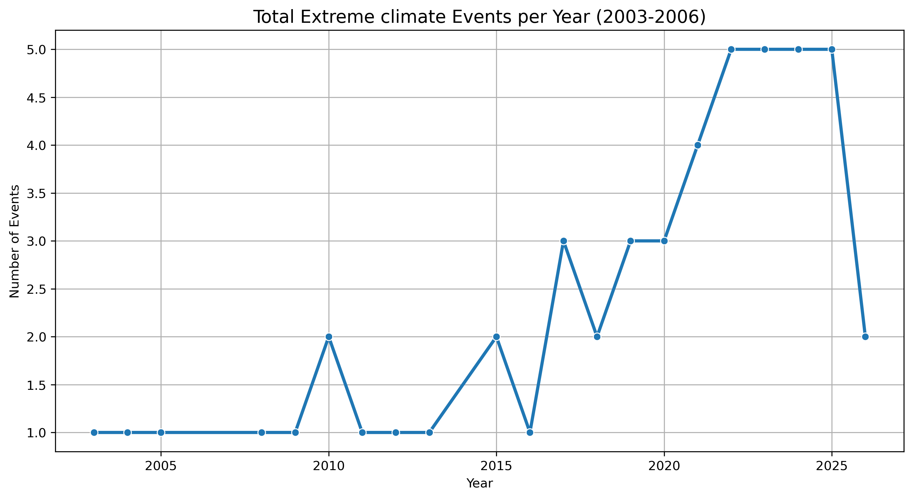
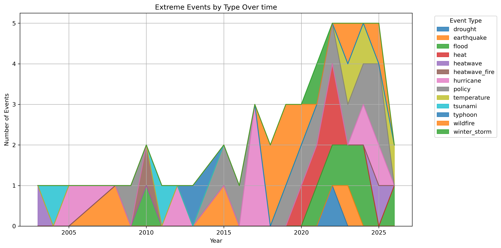
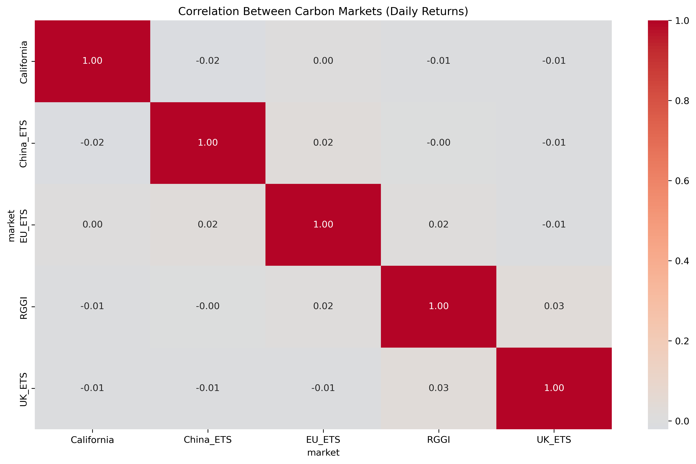

# Global Climate & Energy Transition Amalysis 
**PANDAS + Python EDA PRJECT**

This repository contains explorotory data analysis on the **Global Climate & Energy transition** dataset using **pandas**, **matplotlib** and **seaborn** in jupyter Notebook.
---
## Project Overview
Analyzed multiple interconnected datasets:
- Temperature anomalies (monthly)
- Climate events that occured yearly
- carbon market prices
---

## Analysis
**EXTREME EVENT FREQURNCY TREND**: Extreme climate events increased **340%**( from average 1.0 event/year early period to 4.4 events/year in recent years).

### 1.5°c Threshold Forecasting
- calculated 12-month rolling  average of global temperature anomaly.
- Fitted simple Linear regression to project future trend.
**FINDINGS**: Global temperature has **not yet** consistently exceeded 1.5°c as of 2026 data
### Carbon markets Volatility & Correlation
- computed daily returns, correlation matrix and 30 day rolling volatility.
- Analyzed 5 major carbon markets (EU ETS, RGGI, California, UK ETS, China ETS).
**Insights**: Market shows low correlation with each otrher.
  -Volatility varies significantly across markets.

author: Okunbor Leo Eghosa
